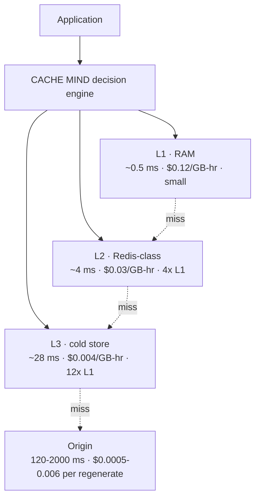
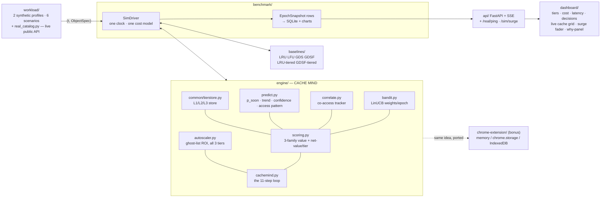

# CACHE MIND — Architecture

**An AI brain that sits above a multi-level cache.**
VH-26 · KASUKABE DEFENCE FORCE

---

## 1. One line

> Score every object by *what it costs us to lose it right now*, decide **where
> it should live** across L1/L2/L3 (or whether to keep it at all), and adapt the
> whole policy at runtime — then show that reasoning live, not as a black box.

LRU/LFU rank by access pattern only. CACHE MIND ranks by a **multi-factor value**
that also knows size and the real latency+$ to regenerate from the origin — then
places each object in the cheapest tier that still earns its keep, so an object
that falls out of RAM becomes a **4 ms warm hit** instead of a **900 ms origin
miss**.

## 2. Multi-level cache



A hit in **any** tier avoids the origin's regeneration latency and dollar cost.
Conventional baselines are single-tier (L1 only) — when full, they evict, and
the next access is a full origin miss.

## 3. Component map



Every module imports only `common/interfaces.py` (`TieredStore` lives in
`common/tierstore.py` so baselines and engine share it). The Chrome extension
is a separate, standalone proof-of-concept — it doesn't import from `engine/`,
it re-implements the same *placement idea* in JavaScript against real browser
storage APIs (see its own README for what's simplified and why).

## 4. The decision loop (per epoch)

| # | step | in code |
|---|---|---|
| 1 | observe cache state | tier occupancy, epoch counters |
| 2 | understand the workload | 8 bandit context features + regime label |
| 3 | **predict the future** | `AccessPredictor.epoch_decay` — per-key rate/trend/confidence/access-pattern |
| 4 | score every object | `value(o)` — bandit-weighted sum of GDSF + heuristics + ML |
| 5 | compute net value per tier | `net_value(o, tier) = E[hits]·serve_saving − hold_cost` |
| 6 | choose actions | promote clear winners, evict dead L3 entries (hysteresis + move budget) |
| 7 | **PREFETCH** | predicted-hot non-resident keys (ghost-list + co-access correlation pool) → warm into L2 |
| 8 | **REFRESH** | hot, near-stale, drift-prone entries → background regenerate |
| 9 | **COMPRESS** | marginal keepers in a tight L2/L3 → store at reduced size |
| 10 | **SCALE** | grow/shrink **all three tiers** — ghost-list ROI (L1), fill+payoff (L2/L3) |
| 11 | **learn** | bandit reward `= hit_rate − 0.35·lat − 0.45·cost`; τ + normalisers adapt |

Per request: `lookup` across tiers → serve (L1/L2/L3 latency) / blocking refresh
/ origin miss → on a miss, `net_value` picks the entry tier, displacing a
**less-valuable** occupant or settling for a colder tier. Every eviction,
promotion, and demotion also snapshots the real signals that justified it
(`CacheMind._explain_entry`) — that's what the dashboard's "why" panel reads.

## 5. Value + placement maths

```
value(o) = L                              # ranking: who to demote/evict first
         + w_gdsf  · GDSF(o)              proven cost-aware heuristic, full magnitude
         + w_rec   · RECENCY(o)           ┐
         + w_fresh · FRESH(o)             ├ [0,1] heuristic refinements GDSF is blind to
         − w_size  · SIZE(o)              ┘
         + w_ml    · ML(o)                learned: p_soon · confidence  ∈ [0,1]

GDSF(o)  = freq · (gen_latency_ms + gen_cost_usd/λ$) / size_kb / core_ref · aging(idle)

serve_saving(o, tier) = max(gen_latency_ms − tier_latency, 0)·λ$  +  gen_cost_usd
hold_cost(o, tier)    = tier_$per_GB_hr · size · horizon
net_value(o, tier)    = E[hits over horizon] · serve_saving − hold_cost
```

The six `w_*` are re-chosen every epoch by the LinUCB bandit — none is
structurally dominant. The `proven` arm zeroes the refinements, so `value ≈
classical GDSF`: a provable safety floor.

**Two more signals, additive on top, that don't feed the ranking directly:**
- **Access pattern** (`predictor.access_pattern`) — classifies each resident
  object as `periodic` / `bursty` / `random` from its own gap statistics
  (coefficient of variation + short/long rate ratio). Surfaced on the
  dashboard; not yet folded into `value()` itself (kept separate to avoid
  moving the already-tuned, documented benchmark numbers).
- **Correlation** (`correlate.py`) — a bounded co-occurrence counter: which
  other objects tend to be requested in the same short window as this one.
  Feeds a second PREFETCH source — when a hot object is served, its known
  partner gets a chance to be warmed too, even before the predictor
  independently flags the partner as trending hot.

## 6. Cost model (`common.CostConfig`)

| component | price |
|---|---|
| L1 / L2 / L3 RAM | $0.12 / $0.03 / $0.004 per GB-hour |
| tier hit latency | 0.5 / 4 / 28 ms |
| origin regeneration | `gen_cost_usd` per miss (from the catalog) |
| user latency | $2 × 10⁻⁶ per request-ms |
| promote / demote | $0.01 per GB moved |

Identical rules for every policy — apples-to-apples. The **`real`** workload
profile (`workload/real_catalog.py`) replaces the sampled distribution with
one genuine HTTP GET per object at catalog-build time — real measured latency
and payload size, not statistics — scoped to the live dashboard only (the
offline benchmark below needs deterministic, repeatable traffic across many
seeds to run a fair ablation, so it keeps the synthetic catalogs).

## 7. Results (api profile, L1 = 12 % of working set)

| policy | hit rate | p95 latency | cost $ | vs GDSF |
|---|---|---|---|---|
| LRU | 0.765 | 426 ms | 148.05 | −120 % |
| LFU | 0.810 | 340 ms | 128.38 | −91 % |
| GDS | 0.727 | 24 ms | 72.55 | −8 % |
| GDSF (best classical, single-tier) | 0.774 | 23 ms | 67.34 | — |
| GDSF-tiered (same L1/L2/L3, dumb placement) | 0.986 | 14 ms | 39.38 | +42 % |
| **CACHE MIND** | **0.986** | **6 ms** | **19.89** | **+70 %** |

(spike / popularity-shift / regime-flip: **−74 / −73 / −82 %** vs GDSF.)

vs the *fair* GDSF-tiered baseline: **−47 to −50 % cost**, ~⅓ the p95 latency.
Ablation: **tiering** (+165–175 % if removed) and **smart refresh** (+93–97 %)
each roughly double cost; autoscaler +4–5 %; bandit / prefetch / compression
±3 % (adaptivity + robustness, not the headline win — said plainly, not oversold).

## 8. The live dashboard — not just a display

`api/live.py` runs several policies in lockstep over the same simulated
traffic; `dashboard/` renders it. Beyond the standard hit-rate/cost/latency
charts, three pieces make the reasoning visible instead of implied:

| panel | what it shows | backed by |
|---|---|---|
| **Surge fader** | a drag control (1x–6x), not a fixed preset — continuously raises the simulated request rate and, past 2x, promotes a batch of cold objects, live | `POST /api/sim/{id}/surge` → `LiveSim.set_surge` |
| **Live cache contents** | objects fading in/out of L1/L2/L3 as CACHE MIND actually admits/promotes/demotes them, colour-coded by access pattern | `CacheMind.sample()`, diffed epoch-to-epoch in the browser |
| **Why panel** | the real signals behind the *latest* eviction/promotion/demotion — future-access probability, regen cost, freshness, trend, final score, plain-English reason | `CacheMind._explain_entry`, attached to the decision feed |

Also: a **`real`** profile (genuine internet traffic, see §6) and a
**`GET /api/real/ping`** endpoint that fires one live HTTP request on demand,
for an in-demo "this is really the internet, not a script" proof.

## 9. Bonus: `chrome-extension/`

A small, separate proof-of-concept — the same 3-tier, value-based placement
idea applied to real browser storage instead of a simulated backend:

| CACHE MIND | extension |
|---|---|
| L1 RAM | in-memory `Map` in a service worker |
| L2 Redis | `chrome.storage.local` |
| L3 cold store | `IndexedDB` |

Deliberately simplified to the GDSF shape only (no bandit/predictor
duplicated in JavaScript) — its job is to prove the *placement* idea, not
re-implement the whole engine twice. Verified with a Node harness mocking
`chrome.storage`/`IndexedDB`/`fetch` driving the real message handler,
including a forced cross-tier demotion that confirmed the displaced object's
value survives the move intact.
