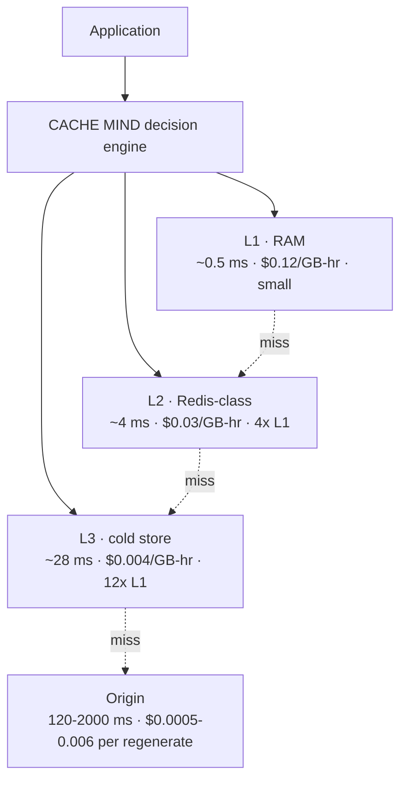
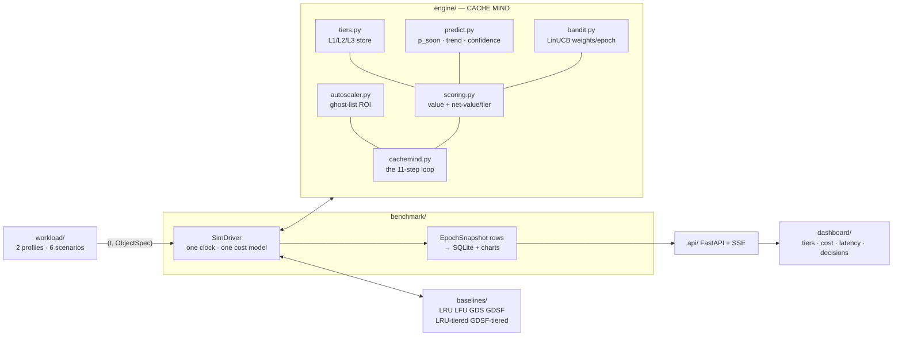

# CACHE MIND — Architecture

**An AI brain that sits above a multi-level cache.**
VH-26 · KASUKABE DEFENCE FORCE

---

## 1. One line

> Score every object by *what it costs us to lose it right now*, decide **where
> it should live** across L1/L2/L3 (or whether to keep it at all), and adapt the
> whole policy at runtime.

LRU/LFU rank by access pattern only. CACHE MIND ranks by a **multi-factor value**
that also knows size and the real latency+$ to regenerate from the origin — then
places each object in the cheapest tier that still earns its keep, so an object
that falls out of RAM becomes a **4 ms warm hit** instead of a **900 ms origin
miss**.

## 2. Multi-level cache



A hit in **any** tier avoids the origin's regeneration latency and dollar cost.
Conventional baselines are single-tier (L1 only) — when full, they evict, and
the next access is a full origin miss.

## 3. Component map



Every module imports only `common/interfaces.py` (`TieredStore` lives in
`common/tierstore.py` so baselines and engine share it).

## 4. The decision loop (per epoch)

| # | step | in code |
|---|---|---|
| 1 | observe cache state | tier occupancy, epoch counters |
| 2 | understand the workload | 8 bandit context features + regime label |
| 3 | **predict the future** | `AccessPredictor.epoch_decay` — per-key rate/trend/confidence |
| 4 | score every object | `value(o)` — GDSF core × bandit-weighted tilt |
| 5 | compute net value per tier | `net_value(o, tier) = E[hits]·serve_saving − hold_cost` |
| 6 | choose actions | promote clear winners, evict dead L3 entries (hysteresis + move budget) |
| 7 | **PREFETCH** | predicted-hot non-resident keys → warm into L2 |
| 8 | **REFRESH** | hot, near-stale, drift-prone entries → background regenerate |
| 9 | **COMPRESS** | marginal keepers in a tight L2/L3 → store at reduced size |
| 10 | **SCALE** | ghost-list ROI test grows/shrinks L1 |
| 11 | **learn** | bandit reward `= hit_rate − 0.35·lat − 0.45·cost`; τ + normalisers adapt |

Per request: `lookup` across tiers → serve (L1/L2/L3 latency) / blocking refresh
/ origin miss → on a miss, `net_value` picks the entry tier, displacing a
**less-valuable** occupant or settling for a colder tier.

## 5. Value + placement maths

```
value(o)  = L + w_core · CORE(o) · (1 + tilt(o))          # ranking: who to demote/evict
CORE(o)   = freq · (gen_latency_ms + gen_cost_usd/λ$) / size_kb   (GDSF, normalised)
tilt(o)   = Σ w_i·(signal_i − 0.4)   over {rec, freq, cost, size, pred}   ∈ ±80%

serve_saving(o, tier) = max(gen_latency_ms − tier_latency, 0)·λ$  +  gen_cost_usd
hold_cost(o, tier)    = tier_$per_GB_hr · size · horizon
net_value(o, tier)    = E[hits over horizon] · serve_saving − hold_cost
```

`w_*` are rewritten every epoch by the LinUCB bandit. At `tilt = 0`, `value` is
exactly GDSF.

## 6. Cost model (`common.CostConfig`)

| component | price |
|---|---|
| L1 / L2 / L3 RAM | $0.12 / $0.03 / $0.004 per GB-hour |
| tier hit latency | 0.5 / 4 / 28 ms |
| origin regeneration | `gen_cost_usd` per miss (from the catalog) |
| user latency | $2 × 10⁻⁶ per request-ms |
| promote / demote | $0.01 per GB moved |

Identical rules for every policy — apples-to-apples.

## 7. Results (api profile)

| | vs GDSF | vs GDSF-tiered (same hardware) |
|---|---|---|
| tiering alone | −45 % cost | — |
| **CACHE MIND** | **−60 % cost** | **−18 % cost, ~⅓ the p95 latency** |

Wins on steady / spike / popularity-shift / regime-flip. Ablation
(`results/ABLATION_api.md`) attributes the contributions: tiering ≫ smart
placement + prefetch ≈ autoscaler ≈ refresh ≫ bandit ≈ compression.
