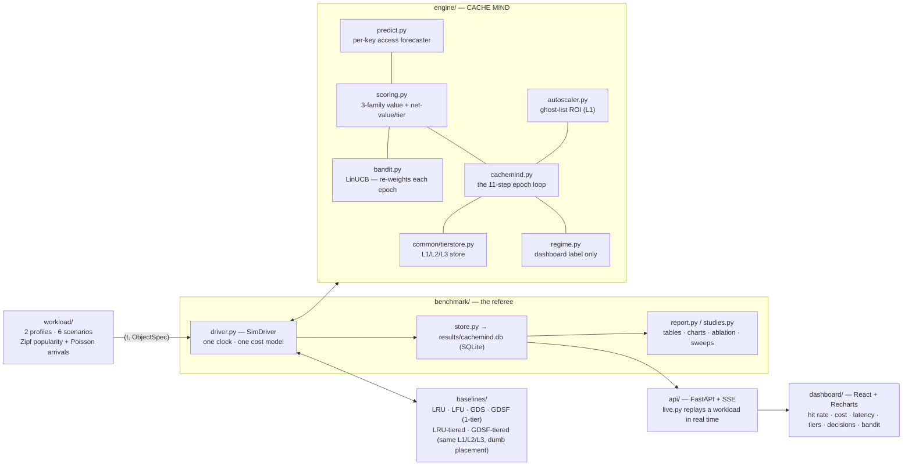

# CACHE MIND — one-page cheat sheet

**VH-26 · KASUKABE DEFENCE FORCE** · PS: *Adaptive, Application-Aware Cache Management System*

> An AI brain that sits above a **multi-level cache**. Every epoch it
> **observes → predicts → scores → decides → executes → learns**, choosing per
> object: **KEEP · PROMOTE · DEMOTE · PREFETCH · REFRESH · COMPRESS · EVICT · SCALE**.
> An object that falls out of RAM becomes a **4 ms warm hit**, not a **900 ms origin miss**.

---

## 1. Architecture (current)



**The golden rule:** every module imports **only** `common/interfaces.py`
(+ `common/tierstore.py`). No module touches another module's internals.

```
common/       the shared contract — ObjectSpec, CacheEntry, TierSpec, CostConfig, CachePolicy ABC
  ├─ interfaces.py   dataclasses + tier constants (ORIGIN/L1/L2/L3) + cost model
  └─ tierstore.py    TieredStore — O(1) get/place/remove/move across 3 tiers

workload/     the data (Priti)
  ├─ catalog.py     per-profile object universe — size, gen-latency, gen-$, ttl, volatility, compressibility
  └─ scenarios.py   request stream — Zipf ranks + per-scenario rate & hot-set evolution

baselines/    the comparison (Priti)
  └─ lru/lfu/gds/gdsf.py + tiered.py   classical policies, from scratch, same CachePolicy interface

engine/       CACHE MIND (Avadh)
  └─ predict · scoring · bandit · regime · autoscaler · cachemind

benchmark/    the referee (Prathamesh)
  └─ driver · runner · store · report · studies

api/ + dashboard/   the live view (Sahil)
```

---

## 2. Every tech in one line

### Stack
| tech | one line |
|---|---|
| **Python 3.14** | whole engine + benchmark + workload; `numpy` for the sampling and the bandit's linear algebra. |
| **numpy** | Zipf/Poisson sampling, lognormal catalogs, and LinUCB's `A⁻¹b` ridge solve. |
| **FastAPI** | serves the live simulator + metadata endpoints (`/meta`, `/sim/*`). |
| **SSE (sse-starlette)** | pushes one JSON frame per simulated epoch to the browser — no polling. |
| **React 18 + Vite + TypeScript** | the dashboard SPA. |
| **Recharts** | the multi-line hit/cost/latency charts + stacked tier bars. |
| **SQLite** | `results/cachemind.db` — every epoch of every run is appended as a queryable row. |
| **pytest** | 32 tests — interface conformance, policy correctness, engine invariants, benchmark determinism. |
| **matplotlib** | static PNG charts for the offline report. |
| **git worktree** | one branch per teammate, integrated without checkout thrash. |

### The cache
| tech | one line |
|---|---|
| **Multi-level cache L1/L2/L3** | RAM (0.5 ms, dear) → Redis-class (4 ms, cheap) → cold store (28 ms, near-free); a hit in *any* tier skips the origin. |
| **DEMOTE instead of evict** | an object leaving L1 drops to L2/L3 instead of being thrown away, so its next hit is warm not a miss. |
| **TieredStore** (`common/tierstore.py`) | a 3-dict store with an O(1) key→tier index; `get / place / remove / move / set_compressed`, per-tier caps. |
| **Ghost list** | remembers recently-evicted (key, size, regen-$) so the autoscaler can measure "what did shrinking cost us". |

### The value model (`scoring.py`) — heuristic + ML hybrid
| tech | one line |
|---|---|
| **GreedyDual-Size-Frequency (GDSF)** | the proven heuristic core: `freq · retrieval_cost / size`, online-normalised, gently aged by idleness. |
| **`cost_ms_equiv`** | converts $-per-regenerate into "ms of user latency it's worth" so one number ranks a paid-API object and a slow-compute object together. |
| **3-family value** | `value = L + w_gdsf·GDSF + w_rec·RECENCY + w_fresh·FRESH − w_size·SIZE + w_ml·ML` — proven + hand-designed + learned, summed. |
| **GreedyDual inflation `L`** | a rising floor added to every score so untouched objects inevitably sink (classic GD aging, no per-object timestamp scan). |
| **Economic tier placement** | `net_value(o, tier) = E[hits]·serve_saving(o,tier) − hold_cost(o,tier)`; put each object in the tier that earns the most, evict only if every tier loses money. |
| **`serve_saving`** | `max(gen_latency − tier_latency, 0)·λ$ + gen_cost_usd` — the latency + $ a warm hit avoids, memoised per object. |
| **Admission control** | a miss builds a hypothetical entry; it only displaces an L1 occupant if its value clears the weakest victim (one-hit scans can't evict the working set). |

### The ML (both online, no training phase, no dataset)
| tech | one line |
|---|---|
| **LinUCB contextual bandit** (`bandit.py`) | each epoch, picks 1 of 6 weight "personalities" by `θ·x + α·√(xᵀA⁻¹x)` (predicted reward + uncertainty), then learns from the realised reward. |
| **8-feature context** | rate, demand entropy, hit-rate trend, mean miss-cost, pressure, evict-rate, ghost-rate, bias. |
| **Bandit reward** | `hit_rate − 0.35·norm_latency − 0.45·norm_cost` — the same three things the cost model charges for. |
| **6 arms** | `balanced` · `proven` (≈ classical GDSF — the safety floor) · `predictive` · `recency` · `freshness` · `lean`. |
| **Access predictor** (`predict.py`) | per-key EWMA of inter-access gap + variance → `p_soon`, `trend`, `confidence`, `expected_hits(n)`. |
| **`ML(o)` signal** | `p_soon · confidence` — feeds the `w_ml` term in every value score and `E[hits]` in the tier maths. |
| **PREFETCH** | predictor flags predicted-hot non-resident keys to warm from origin ahead of demand (small effect on Zipf traffic — kept for churn). |

### Adaptivity
| tech | one line |
|---|---|
| **Cost-benefit autoscaler** (`autoscaler.py`) | grows L1 only when ghost-hit regen-$ beats the marginal RAM rent; shrinks when a step sits idle — bounded, symmetric. |
| **L2/L3 autoscaling** (`cachemind._autoscale`) | grow at >90 % fill if the tier still earns its hits, shrink after 3 epochs below 50 % — within `L2∈[2×,10×]`, `L3∈[3×,30×]` of L1. |
| **Background refresh** | a stale hit is **served immediately** and the object is queued to regenerate next epoch — never a blocking refetch (unless drift risk is extreme). |
| **COMPRESS** | marginal keepers in a tight tier are stored at reduced size (per-object `compressible` ratio), paying a small decompress latency on hit. |
| **RegimeDetector** (`regime.py`) | a cheap explainable label (`steady/spike/popularity_shift/cold_start`) for the dashboard — does **not** drive weights, the bandit does. |

### Workload / data design
| tech | one line |
|---|---|
| **2 profiles** | `api` (6000 small objects, $-per-miss) and `recsys` (2500 big objects, latency-per-miss) — same engine must win both, no retuning. |
| **Bimodal generation** | each object is "cheap" or "expensive" to regenerate (separate latency + $ ranges) — models DB-read vs paid-API / model-inference. |
| **Zipf popularity** | request ranks drawn `∝ 1/rank^1.05`; a per-scenario permutation maps rank → object. |
| **Poisson arrivals** | per-second request count `~ Poisson(λ(t))`, λ shaped by the scenario. |
| **6 scenarios** | `steady` · `spike` (×3 rate + cold objects promoted) · `popularity_shift` (drifting hot set) · `diurnal` (sine rate + contracting set) · `cold_start` (empty + ramp) · `regime_flip` (alternating expensive-stable / cheap-churny — the bandit's exam). |

### Benchmark / evaluation
| tech | one line |
|---|---|
| **SimDriver** (`driver.py`) | owns the single clock and the single cost model; every policy is charged by identical rules — apples to apples. |
| **Ablations** (`studies.py`) | re-runs CACHE MIND with one capability disabled at a time to attribute the win (`CM-notier`, `CM-norefresh`, …). |
| **Sensitivity sweep** | re-runs every policy across L1 = 5–40 % of the working set to show the win isn't a single lucky cache size. |
| **`savings_matrix`** | SQL over the epochs table → cost saving of each policy vs a chosen baseline, per scenario. |

---

## 3. Cost model (`common.CostConfig`) — identical for every policy

| component | price |
|---|---|
| L1 / L2 / L3 memory | **$0.12 / $0.030 / $0.004** per GB-hour |
| L1 / L2 / L3 hit latency | **0.5 / 4 / 28 ms** |
| origin regeneration | `gen_latency_ms` (120–2200 ms) + `gen_cost_usd` ($0.0005–0.006) per miss, from the catalog |
| user-visible latency | **$2 × 10⁻⁶** per request-ms |
| promote / demote | **$0.010** per GB moved |
| autoscaler step | 4 MiB granularity |

Total cost billed = origin $ + latency $ + memory $ + movement $.

---

## 4. The epoch loop (`cachemind.py`) — 11 steps

```
1  observe     tier occupancy + epoch counters
2  understand  build 8-feature context + regime label
3  predict     roll per-key rate/gap EWMAs (predict.py)
4  score       value(o) for every resident object (3-family, bandit weights)
5  place       net_value(o, tier) for each tier — where should it live?
6  promote/    move clear winners up, evict only dead entries
   evict       (hysteresis + per-epoch move budget)
7  prefetch    predicted-hot non-resident keys → warm into L2
8  refresh     stale hits seen this epoch → background regenerate
9  compress    marginal keepers in a tight tier → store smaller
10 scale       grow/shrink L1 (ghost ROI) and L2/L3 (fill + payoff)
11 learn       bandit reward → update arm → pick next epoch's weights; τ + normalisers adapt
```

---

## 5. Results (api profile, L1 = 12 % of working set, identical cost model)

| policy | hit rate | p95 latency | cost $ | vs GDSF |
|---|---|---|---|---|
| LRU | 0.77 | 426 ms | 148 | −120 % |
| LFU | 0.81 | 340 ms | 128 | −91 % |
| GDSF (best classical 1-tier) | 0.77 | 23 ms | 67 | — |
| GDSF-tiered (same L1/L2/L3, dumb placement) | 0.99 | 14 ms | 39 | +42 % |
| **CACHE MIND** | **0.99** | **6 ms** | **20** | **+71 %** |

- spike / popularity-shift / regime-flip: **−74 / −73 / −82 %** cost vs GDSF.
- vs the *fair* `GDSF-tiered` baseline: **−47 to −50 % cost**, ~⅓ the p95 latency.
- **Ablation** — what carries the win: **tiering** (+165–175 % cost if removed) and
  **smart refresh** (+93–97 %); autoscaler +4–5 %; bandit / prefetch / compression ±3 %
  (there for adaptivity + robustness, honest about it).
- Cheapest at **every** L1 size from 5 % to 40 %.

---

## 6. Who owns what

| member | GitHub | modules |
|---|---|---|
| Avadh Mehta | `avadh-lang` | `engine/`, `common/`, `tests/`, docs, integration |
| Priti Kangne | `pritikangne266-dev` | `workload/`, `baselines/` |
| Prathamesh | `Prathamesh-2803` | `benchmark/` |
| Sahil Kadam | `SahilKadam-dev` | `api/`, `dashboard/` |
