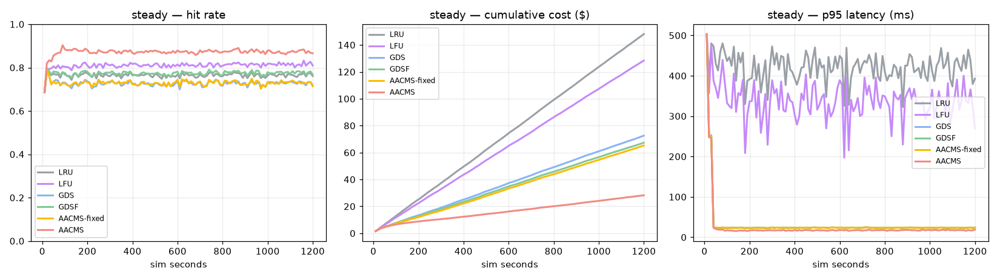
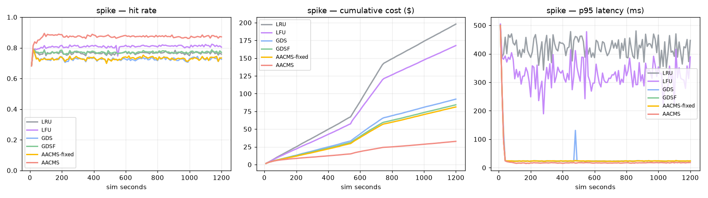
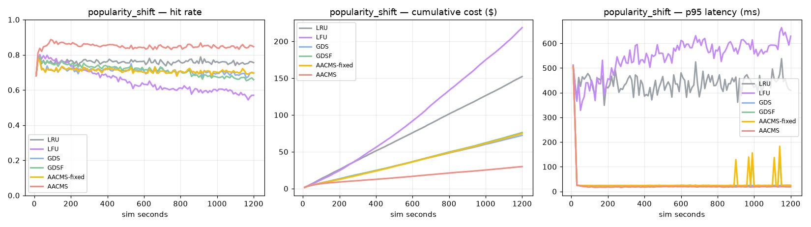
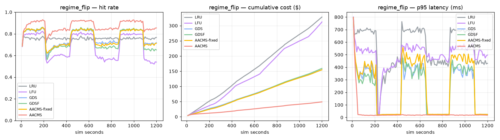
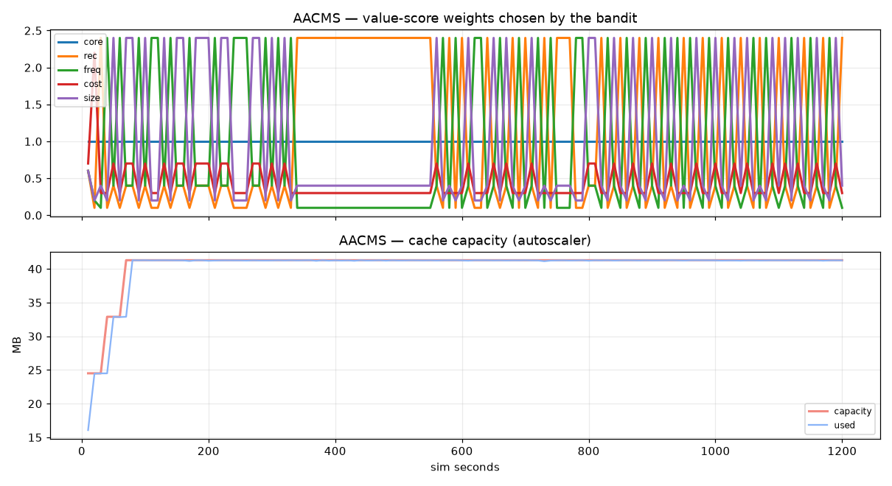

# AACMS benchmark — `api` profile

_generated 2026-09-04 13:00:49_

Cost model: managed-cache RAM @ $0.12/GB-hr, origin $ per regeneration from the object catalog, latency business-cost @ $2e-6/ms. Identical workload and cost rules for every policy.

## steady

| policy | hit rate | stale rate | p95 latency (ms) | total cost ($) | vs GDSF | vs LRU |
|---|---|---|---|---|---|---|
| LRU | 0.765 | 0.235 | 425.7 | 148.055 | -119.8% | +0.0% |
| LFU | 0.810 | 0.190 | 339.6 | 128.377 | -90.6% | +13.3% |
| GDS | 0.727 | 0.273 | 24.0 | 72.555 | -7.7% | +51.0% |
| GDSF | 0.774 | 0.226 | 23.3 | 67.344 | +0.0% | +54.5% |
| AACMS-fixed | 0.729 | 0.271 | 23.8 | 65.231 | +3.1% | +55.9% |
| AACMS | 0.871 | 0.190 | 17.6 | 28.256 | +58.0% | +80.9% |

AACMS autoscaler settled at **41 MB** (started at 24 MB).

## spike

| policy | hit rate | stale rate | p95 latency (ms) | total cost ($) | vs GDSF | vs LRU |
|---|---|---|---|---|---|---|
| LRU | 0.765 | 0.235 | 426.1 | 198.005 | -134.9% | +0.0% |
| LFU | 0.807 | 0.193 | 330.6 | 167.781 | -99.1% | +15.3% |
| GDS | 0.726 | 0.274 | 23.8 | 92.284 | -9.5% | +53.4% |
| GDSF | 0.770 | 0.230 | 23.0 | 84.284 | +0.0% | +57.4% |
| AACMS-fixed | 0.731 | 0.269 | 23.6 | 81.196 | +3.7% | +59.0% |
| AACMS | 0.872 | 0.178 | 17.3 | 32.756 | +61.1% | +83.5% |

AACMS autoscaler settled at **41 MB** (started at 25 MB).

## popularity_shift

| policy | hit rate | stale rate | p95 latency (ms) | total cost ($) | vs GDSF | vs LRU |
|---|---|---|---|---|---|---|
| LRU | 0.758 | 0.242 | 441.9 | 152.187 | -99.9% | +0.0% |
| LFU | 0.652 | 0.348 | 558.2 | 218.604 | -187.1% | -43.6% |
| GDS | 0.708 | 0.292 | 23.9 | 72.327 | +5.0% | +52.5% |
| GDSF | 0.712 | 0.288 | 24.0 | 76.137 | +0.0% | +50.0% |
| AACMS-fixed | 0.709 | 0.291 | 24.2 | 74.844 | +1.7% | +50.8% |
| AACMS | 0.848 | 0.211 | 19.0 | 29.906 | +60.7% | +80.3% |

AACMS autoscaler settled at **41 MB** (started at 25 MB).

## regime_flip

| policy | hit rate | stale rate | p95 latency (ms) | total cost ($) | vs GDSF | vs LRU |
|---|---|---|---|---|---|---|
| LRU | 0.756 | 0.244 | 560.2 | 328.366 | -106.2% | +0.0% |
| LFU | 0.642 | 0.358 | 484.9 | 312.182 | -96.0% | +4.9% |
| GDS | 0.742 | 0.258 | 121.9 | 154.802 | +2.8% | +52.9% |
| GDSF | 0.719 | 0.281 | 154.7 | 159.276 | +0.0% | +51.5% |
| AACMS-fixed | 0.737 | 0.263 | 195.1 | 154.649 | +2.9% | +52.9% |
| AACMS | 0.857 | 0.185 | 18.9 | 48.926 | +69.3% | +85.1% |

AACMS autoscaler settled at **41 MB** (started at 25 MB).

## Charts

