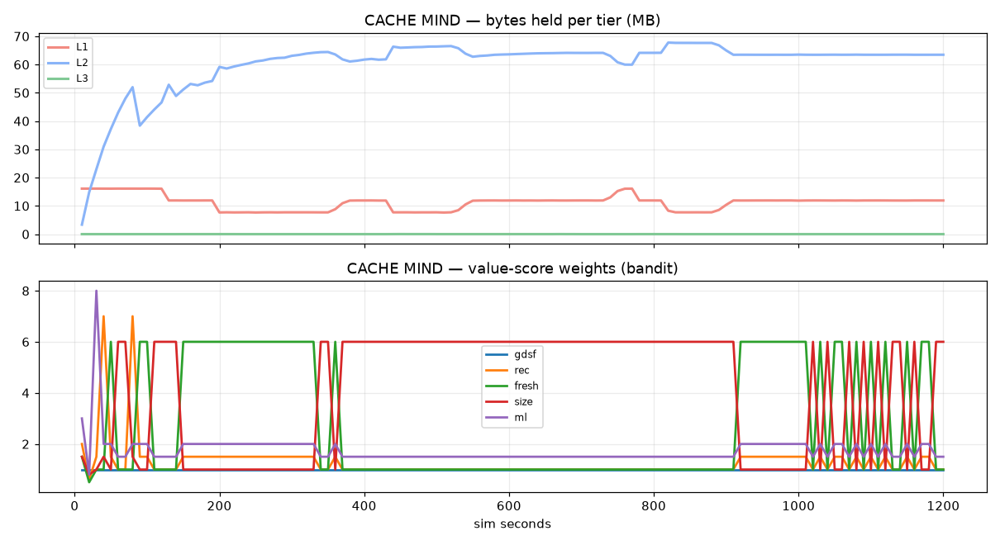

# CACHE MIND benchmark — `api` profile

_generated 2026-09-05 05:29:13_

Same workload and cost model for every policy. Single-tier policies use one RAM tier; `*-tiered` and `CACHE MIND` get the same L1/L2/L3 hardware (L1 = 12 % of the working set, L2 = 4×L1, L3 = 12×L1).

## steady

| policy | hit rate | p95 ms | cost $ | vs GDSF | vs GDSF-tiered |
|---|---|---|---|---|---|
| LRU | 0.765 | 426 | 148.05 | -120% | -276% |
| LFU | 0.810 | 340 | 128.38 | -91% | -226% |
| GDS | 0.727 | 24 | 72.55 | -8% | -84% |
| GDSF | 0.774 | 23 | 67.34 | +0% | -71% |
| LRU-tiered | 0.986 | 15 | 39.40 | +41% | -0% |
| GDSF-tiered | 0.986 | 14 | 39.38 | +42% | +0% |
| CM-fixed | 0.982 | 28 | 39.89 | +41% | -1% |
| CACHE MIND | 0.986 | 6 | 19.89 | +70% | +49% |

## spike

| policy | hit rate | p95 ms | cost $ | vs GDSF | vs GDSF-tiered |
|---|---|---|---|---|---|
| LRU | 0.765 | 426 | 198.01 | -135% | -371% |
| LFU | 0.807 | 331 | 167.78 | -99% | -299% |
| GDS | 0.726 | 24 | 92.28 | -9% | -120% |
| GDSF | 0.770 | 23 | 84.28 | +0% | -101% |
| LRU-tiered | 0.989 | 12 | 42.08 | +50% | -0% |
| GDSF-tiered | 0.989 | 9 | 42.00 | +50% | +0% |
| CM-fixed | 0.987 | 28 | 43.26 | +49% | -3% |
| CACHE MIND | 0.989 | 6 | 22.01 | +74% | +48% |

## popularity_shift

| policy | hit rate | p95 ms | cost $ | vs GDSF | vs GDSF-tiered |
|---|---|---|---|---|---|
| LRU | 0.758 | 442 | 152.19 | -100% | -283% |
| LFU | 0.652 | 558 | 218.60 | -187% | -450% |
| GDS | 0.708 | 24 | 72.33 | +5% | -82% |
| GDSF | 0.712 | 24 | 76.14 | +0% | -91% |
| LRU-tiered | 0.986 | 17 | 39.55 | +48% | +1% |
| GDSF-tiered | 0.986 | 18 | 39.77 | +48% | +0% |
| CM-fixed | 0.982 | 28 | 41.05 | +46% | -3% |
| CACHE MIND | 0.986 | 6 | 20.85 | +73% | +48% |

## regime_flip

| policy | hit rate | p95 ms | cost $ | vs GDSF | vs GDSF-tiered |
|---|---|---|---|---|---|
| LRU | 0.756 | 560 | 328.37 | -106% | -514% |
| LFU | 0.642 | 485 | 312.18 | -96% | -484% |
| GDS | 0.742 | 122 | 154.80 | +3% | -190% |
| GDSF | 0.719 | 155 | 159.28 | +0% | -198% |
| LRU-tiered | 0.992 | 17 | 53.37 | +66% | +0% |
| GDSF-tiered | 0.992 | 13 | 53.47 | +66% | +0% |
| CM-fixed | 0.989 | 28 | 55.23 | +65% | -3% |
| CACHE MIND | 0.992 | 6 | 28.56 | +82% | +47% |

## Charts

