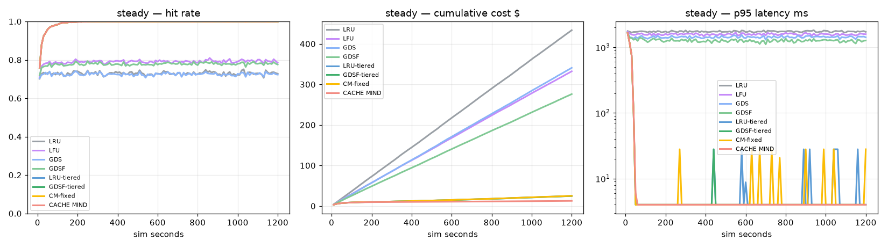
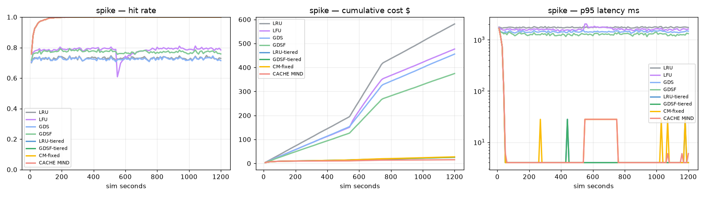
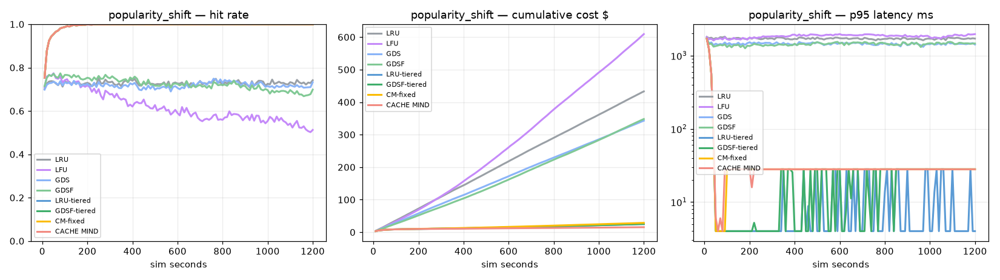
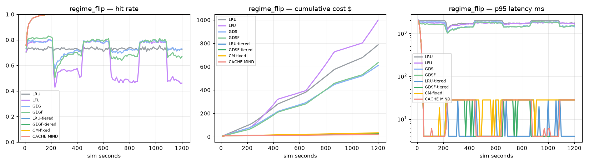
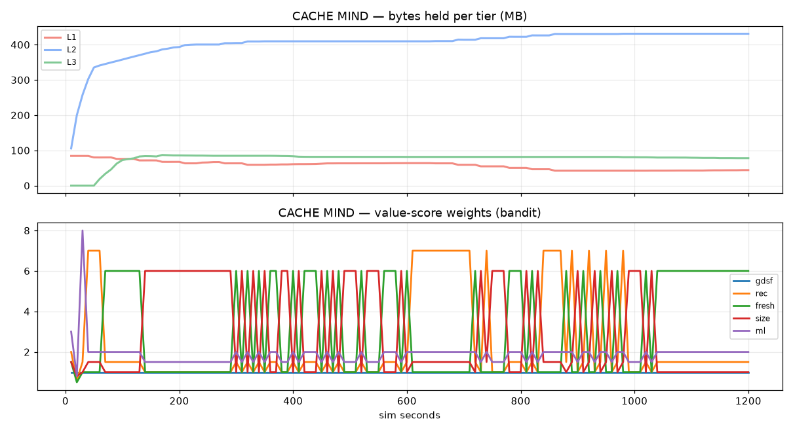

# CACHE MIND benchmark — `recsys` profile

_generated 2026-09-05 05:31:39_

Same workload and cost model for every policy. Single-tier policies use one RAM tier; `*-tiered` and `CACHE MIND` get the same L1/L2/L3 hardware (L1 = 12 % of the working set, L2 = 4×L1, L3 = 12×L1).

## steady

| policy | hit rate | p95 ms | cost $ | vs GDSF | vs GDSF-tiered |
|---|---|---|---|---|---|
| LRU | 0.729 | 1749 | 433.65 | -57% | -1646% |
| LFU | 0.790 | 1592 | 332.34 | -20% | -1238% |
| GDS | 0.725 | 1435 | 340.84 | -23% | -1272% |
| GDSF | 0.778 | 1278 | 276.11 | +0% | -1012% |
| LRU-tiered | 0.994 | 4 | 25.05 | +91% | -1% |
| GDSF-tiered | 0.994 | 4 | 24.84 | +91% | +0% |
| CM-fixed | 0.994 | 4 | 25.17 | +91% | -1% |
| CACHE MIND | 0.994 | 4 | 12.77 | +95% | +49% |

## spike

| policy | hit rate | p95 ms | cost $ | vs GDSF | vs GDSF-tiered |
|---|---|---|---|---|---|
| LRU | 0.730 | 1749 | 581.29 | -55% | -2160% |
| LFU | 0.772 | 1676 | 476.86 | -27% | -1754% |
| GDS | 0.725 | 1434 | 455.93 | -22% | -1672% |
| GDSF | 0.770 | 1292 | 374.76 | +0% | -1357% |
| LRU-tiered | 0.996 | 4 | 25.97 | +93% | -1% |
| GDSF-tiered | 0.996 | 4 | 25.73 | +93% | +0% |
| CM-fixed | 0.995 | 28 | 27.32 | +93% | -6% |
| CACHE MIND | 0.996 | 28 | 15.29 | +96% | +41% |

## popularity_shift

| policy | hit rate | p95 ms | cost $ | vs GDSF | vs GDSF-tiered |
|---|---|---|---|---|---|
| LRU | 0.728 | 1712 | 432.99 | -24% | -1615% |
| LFU | 0.618 | 1861 | 609.23 | -75% | -2313% |
| GDS | 0.720 | 1459 | 342.88 | +1% | -1258% |
| GDSF | 0.724 | 1451 | 348.05 | +0% | -1279% |
| LRU-tiered | 0.994 | 4 | 25.06 | +93% | +1% |
| GDSF-tiered | 0.994 | 28 | 25.25 | +93% | +0% |
| CM-fixed | 0.994 | 28 | 28.75 | +92% | -14% |
| CACHE MIND | 0.994 | 28 | 15.44 | +96% | +39% |

## regime_flip

| policy | hit rate | p95 ms | cost $ | vs GDSF | vs GDSF-tiered |
|---|---|---|---|---|---|
| LRU | 0.728 | 1865 | 787.49 | -24% | -2668% |
| LFU | 0.594 | 1698 | 999.13 | -57% | -3412% |
| GDS | 0.728 | 1624 | 609.90 | +4% | -2044% |
| GDSF | 0.706 | 1537 | 634.89 | +0% | -2132% |
| LRU-tiered | 0.996 | 4 | 28.04 | +96% | +1% |
| GDSF-tiered | 0.996 | 28 | 28.45 | +96% | +0% |
| CM-fixed | 0.996 | 28 | 33.57 | +95% | -18% |
| CACHE MIND | 0.996 | 28 | 18.28 | +97% | +36% |

## Charts

