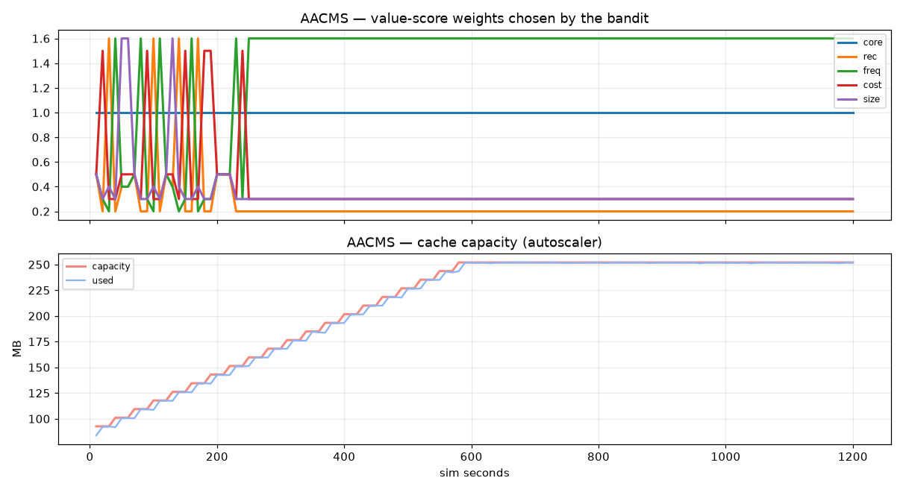

# AACMS benchmark — `recsys` profile

_generated 2026-09-04 09:54:56_

Cost model: managed-cache RAM @ $0.12/GB-hr, origin $ per regeneration from the object catalog, latency business-cost @ $2e-6/ms. Identical workload and cost rules for every policy.

## steady

| policy | hit rate | stale rate | p95 latency (ms) | total cost ($) | vs GDSF | vs LRU |
|---|---|---|---|---|---|---|
| LRU | 0.729 | 0.271 | 1748.8 | 433.651 | -57.1% | +0.0% |
| LFU | 0.790 | 0.210 | 1591.9 | 332.336 | -20.4% | +23.4% |
| GDS | 0.725 | 0.275 | 1435.1 | 340.836 | -23.4% | +21.4% |
| GDSF | 0.778 | 0.222 | 1278.1 | 276.114 | +0.0% | +36.3% |
| AACMS-fixed | 0.788 | 0.413 | 1322.6 | 251.588 | +8.9% | +42.0% |
| AACMS | 0.876 | 0.347 | 555.5 | 117.716 | +57.4% | +72.9% |

AACMS autoscaler settled at **252 MB** (started at 93 MB).

## spike

| policy | hit rate | stale rate | p95 latency (ms) | total cost ($) | vs GDSF | vs LRU |
|---|---|---|---|---|---|---|
| LRU | 0.730 | 0.270 | 1748.8 | 581.294 | -55.1% | +0.0% |
| LFU | 0.772 | 0.228 | 1676.0 | 476.859 | -27.2% | +18.0% |
| GDS | 0.725 | 0.275 | 1434.2 | 455.925 | -21.7% | +21.6% |
| GDSF | 0.770 | 0.230 | 1292.4 | 374.760 | +0.0% | +35.5% |
| AACMS-fixed | 0.781 | 0.366 | 1336.4 | 345.822 | +7.7% | +40.5% |
| AACMS | 0.883 | 0.290 | 467.9 | 146.474 | +60.9% | +74.8% |

AACMS autoscaler settled at **252 MB** (started at 93 MB).

## popularity_shift

| policy | hit rate | stale rate | p95 latency (ms) | total cost ($) | vs GDSF | vs LRU |
|---|---|---|---|---|---|---|
| LRU | 0.728 | 0.272 | 1712.5 | 432.989 | -24.4% | +0.0% |
| LFU | 0.618 | 0.382 | 1860.5 | 609.232 | -75.0% | -40.7% |
| GDS | 0.720 | 0.280 | 1459.0 | 342.884 | +1.5% | +20.8% |
| GDSF | 0.724 | 0.276 | 1451.1 | 348.052 | +0.0% | +19.6% |
| AACMS-fixed | 0.718 | 0.336 | 1520.5 | 346.431 | +0.5% | +20.0% |
| AACMS | 0.856 | 0.238 | 766.1 | 144.248 | +58.6% | +66.7% |

AACMS autoscaler settled at **252 MB** (started at 93 MB).

## Charts

